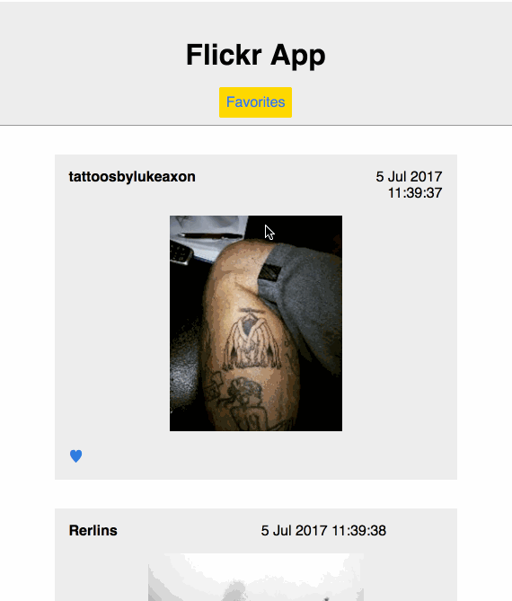

Time spent: 12 hours
Difficulties Encountered:
- Lots of set-up issues. Express and database set-up. React-router set-up.

Bugs:
- First load of the app does not show images immediately because fetching takes too long. Requires user to reload the page after a minute for images to show up.

How to run the app:
1. Open up two terminal tabs
2. In one of them: `mysql -u root < schema.sql`. This creates the database
3. Run `npm start`
4. In the other tab, run: `npm run build`
5. Open up `http://localhost:3000/#/`.
6. Wait a minute for the database to update images (This is a bug that happens on the first load of the app.)
7. Reload `http://localhost:3000/#/`. You should see pictures.
